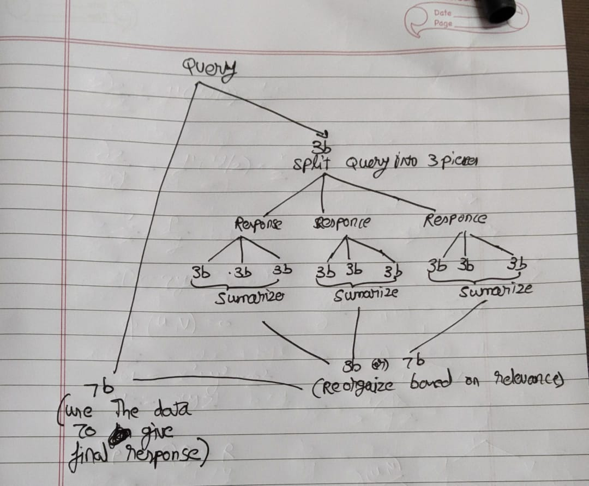

# Let's BOIBYC for AI

but what is BOIBYC , it is Better Own It Before You Can
i can own digital copy of a movie and own it forever instead of getting behind the subscription paywall and still don't have the right to own and they can remove it whenever they want . so right now AI can be seen as easy to access and a good thing but they might capitalize so badly that we might loose our money and convenience . so i wonder why can't i find the way to have my own self hosted AI model and use it for my personal use . (here they refer to big company)

## How will i do it 

Build and customize AI model as per our need using Open source AI and cloud computing

## Things to Learn 

### Cloud 
Syllabus : [Use this reference or use them itself](https://skillbuilder.aws/learn/94T2BEN85A/aws-cloud-practitioner-essentials/8D79F3AVR7)

### Gen AI
Syllabus : [Use this reference or use them itself](https://youtu.be/F0GQ0l2NfHA)

### Containerization
Syllabus : [Use this reference or use them itself](https://youtu.be/kTp5xUtcalw)

### Linux
Syllabus : [Use this reference or use them itself](https://youtu.be/sWbUDq4S6Y8)

### Git and Github
Syllabus : [Use this reference or use them itself](https://youtu.be/RGOj5yH7evk)

### API development 
Syllabus : [Use this reference or use them itself](https://youtu.be/0sOvCWFmrtA)

## Track and plan the progress here

### I think i should start
let's learn linux once in a while now let's start building the project in levels and we can follow arc system where we do a set of things then move to next arc where we do another set of things . each arc has it's own directory and plan to go forward

**the guiding levels that help us to get started into the rabbit hole**

1. Learning Docker and running a local model
2. using GPU and CPU for computing
3. connecting Local model to internet to use as a AI search engine
4. use n8n to split the task and get more reliable info like perplexity
5. use Third party AI API to do other AI stuffs and fully switch from AI subscription

**the way i can use this AI stuff** :

We can go more crazy and use once we got everything in cloud , we can use n8n to manage my home seed box , or even make a pipeline for converting document to best quality anki notes (which might help us to learn lot of stuff) or make a learning assistant based on my needs or make it compatible with THE SYSTEM
see this video for context : [n8n manage homelab](https://www.youtube.com/watch?v=budTmdQfXYU)

### Project arc 1
- in this arc I'm trying to build a basic pipeline in my local machine to do web search with the small models

- for the web data summarization i will use sumy package and it is good enough to take me into NLP rabbit hole . 
i can get into the rabbit hole by doing the projects in their [README.md](https://github.com/miso-belica/sumy) , this can be done during the time when i build anki flashcards maker

- make sure to learn stuff from this project 

- resources for getting crazy in NLP [link_1](https://www.sbert.net/index.html) [link_2](https://www.nltk.org/book/) [link_3](https://ia803202.us.archive.org/31/items/python_ebooks_2020/python_3_text_processing_with_nltk_cookbook.pdf)

#### Progress from here
* if it is successfull then maybe we can use GPU 
* but for that we should use docker cause we need to install and configure lots of software
* if successfull again try different local AI service or web search API
* once we are good to go we can transfer this to cloud if the process is really slow
* finally switch to n8n for advanced config
* the rest is just my imagination but let's focus on this stuff

### Project arc 2
in this arc i will try to polish the stuff done in arc 1 and make the AI chatbot which i can confidently replace to perplexity . one way is try for RAG process which will make the things more easy
# Let's BOIBYC for AI

but what is BOIBYC , it is Better Own It Before You Can
i can own digital copy of a movie and own it forever instead of getting behind the subscription paywall and still don't have the right to own and they can remove it whenever they want . so right now AI can be seen as easy to access and a good thing but they might capitalize so badly that we might loose our money and convenience . so i wonder why can't i find the way to have my own self hosted AI model and use it for my personal use . (here they refer to big company)

## How will i do it 

Build and customize AI model as per our need using Open source AI and cloud computing

## Things to Learn 

### Cloud 
Syllabus : [Use this reference or use them itself](https://skillbuilder.aws/learn/94T2BEN85A/aws-cloud-practitioner-essentials/8D79F3AVR7)

### Gen AI
Syllabus : [Use this reference or use them itself](https://youtu.be/F0GQ0l2NfHA)

### Containerization
Syllabus : [Use this reference or use them itself](https://youtu.be/kTp5xUtcalw)

### Linux
Syllabus : [Use this reference or use them itself](https://youtu.be/sWbUDq4S6Y8)

### Git and Github
Syllabus : [Use this reference or use them itself](https://youtu.be/RGOj5yH7evk)

### API development 
Syllabus : [Use this reference or use them itself](https://youtu.be/0sOvCWFmrtA)

## Track and plan the progress here

### I think i should start
let's learn linux once in a while now let's start building the project in levels and we can follow arc system where we do a set of things then move to next arc where we do another set of things . each arc has it's own directory and plan to go forward

**the guiding levels that help us to get started into the rabbit hole**

1. Learning Docker and running a local model
2. using GPU and CPU for computing
3. connecting Local model to internet to use as a AI search engine
4. use n8n to split the task and get more reliable info like perplexity
5. use Third party AI API to do other AI stuffs and fully switch from AI subscription

**the way i can use this AI stuff** :

We can go more crazy and use once we got everything in cloud , we can use n8n to manage my home seed box , or even make a pipeline for converting document to best quality anki notes (which might help us to learn lot of stuff) or make a learning assistant based on my needs or make it compatible with THE SYSTEM
see this video for context : [n8n manage homelab](https://www.youtube.com/watch?v=budTmdQfXYU)

### Project arc 1
- in this arc I'm trying to build a basic pipeline in my local machine to do web search with the small models

- for the web data summarization i will use sumy package and it is good enough to take me into NLP rabbit hole . 
i can get into the rabbit hole by doing the projects in their [README.md](https://github.com/miso-belica/sumy) , this can be done during the time when i build anki flashcards maker

- make sure to learn stuff from this project 

- resources for getting crazy in NLP [link_1](https://www.sbert.net/index.html) [link_2](https://www.nltk.org/book/) [link_3](https://ia803202.us.archive.org/31/items/python_ebooks_2020/python_3_text_processing_with_nltk_cookbook.pdf)

#### Progress from here
* if it is successfull then maybe we can use GPU 
* but for that we should use docker cause we need to install and configure lots of software
* if successfull again try different local AI service or web search API
* once we are good to go we can transfer this to cloud if the process is really slow
* finally switch to n8n for advanced config
* the rest is just my imagination but let's focus on this stuff

### Project arc 2
in this arc i will try to polish the stuff done in arc 1 and make the AI chatbot which i can confidently replace to perplexity . one way is try for RAG process which will make the things more easy
# Let's BOIBYC for AI

but what is BOIBYC , it is Better Own It Before You Can
i can own digital copy of a movie and own it forever instead of getting behind the subscription paywall and still don't have the right to own and they can remove it whenever they want . so right now AI can be seen as easy to access and a good thing but they might capitalize so badly that we might loose our money and convenience . so i wonder why can't i find the way to have my own self hosted AI model and use it for my personal use . (here they refer to big company)

## How will i do it 

Build and customize AI model as per our need using Open source AI and cloud computing

## Things to Learn 

### Cloud 
Syllabus : [Use this reference or use them itself](https://skillbuilder.aws/learn/94T2BEN85A/aws-cloud-practitioner-essentials/8D79F3AVR7)

### Gen AI
Syllabus : [Use this reference or use them itself](https://youtu.be/F0GQ0l2NfHA)

### Containerization
Syllabus : [Use this reference or use them itself](https://youtu.be/kTp5xUtcalw)

### Linux
Syllabus : [Use this reference or use them itself](https://youtu.be/sWbUDq4S6Y8)

### Git and Github
Syllabus : [Use this reference or use them itself](https://youtu.be/RGOj5yH7evk)

### API development 
Syllabus : [Use this reference or use them itself](https://youtu.be/0sOvCWFmrtA)

## Track and plan the progress here

### I think i should start
let's learn linux once in a while now let's start building the project in levels and we can follow arc system where we do a set of things then move to next arc where we do another set of things . each arc has it's own directory and plan to go forward

**the guiding levels that help us to get started into the rabbit hole**

1. Learning Docker and running a local model
2. using GPU and CPU for computing
3. connecting Local model to internet to use as a AI search engine
4. use n8n to split the task and get more reliable info like perplexity
5. use Third party AI API to do other AI stuffs and fully switch from AI subscription

**the way i can use this AI stuff** :

We can go more crazy and use once we got everything in cloud , we can use n8n to manage my home seed box , or even make a pipeline for converting document to best quality anki notes (which might help us to learn lot of stuff) or make a learning assistant based on my needs or make it compatible with THE SYSTEM
see this video for context : [n8n manage homelab](https://www.youtube.com/watch?v=budTmdQfXYU)

### Project arc 1
- in this arc I'm trying to build a basic pipeline in my local machine to do web search with the small models

- for the web data summarization i will use sumy package and it is good enough to take me into NLP rabbit hole . 
i can get into the rabbit hole by doing the projects in their [README.md](https://github.com/miso-belica/sumy) , this can be done during the time when i build anki flashcards maker

- make sure to learn stuff from this project 

- resources for getting crazy in NLP [link_1](https://www.sbert.net/index.html) [link_2](https://www.nltk.org/book/) [link_3](https://ia803202.us.archive.org/31/items/python_ebooks_2020/python_3_text_processing_with_nltk_cookbook.pdf)

- arc 1 is finally over but it is slow(around 15 min for single prompt) and very ineffective

- so in next arc we will try to use our intel GPU to make the process more faster

#### Progress from here
* if it is successfull then maybe we can use GPU 
* but for that we should use docker cause we need to install and configure lots of software
* if successfull again try different local AI service or web search API
* once we are good to go we can transfer this to cloud if the process is really slow
* finally switch to n8n for advanced config
* the rest is just my imagination but let's focus on this stuff

### Project arc 2
- in this arc i will try to use my intel Integrated GPU and reduce the painfully slow time 

- Arc 1 is success but we still need to improve the speed

- maybe try using [this prompt improver](https://github.com/danielmiessler/Fabric/blob/main/data/patterns/improve_prompt/system.md) and [Fabric](https://github.com/danielmiessler/Fabric.git) in the pipeline for better results

- this arc must strictly use docker cause we may need lots of software

- in arc_2 , we will learn Docker [from this video](https://youtu.be/fqMOX6JJhGo) . we may do other stuff after learning docker

- put down all the things learned in arc_1 into a md notes and make it into a anki deck to preserve this valuable knowledge , this is just a side thing along with project which will be done after learning docker and reviewing cards as the project progress and till the end of time

-i made a effiecient way to make pdf to anki , it is simply refining the prompt for making pdf into simple material (or any specification if wanted) then using the refined prompt to change the material into deck . dividing the pdf to 15-20 page pdf always yield best results

- i also tried the same for online video lecture but it got failed and explained in Arc_2/Docker_Learning/Failed_Attempt

